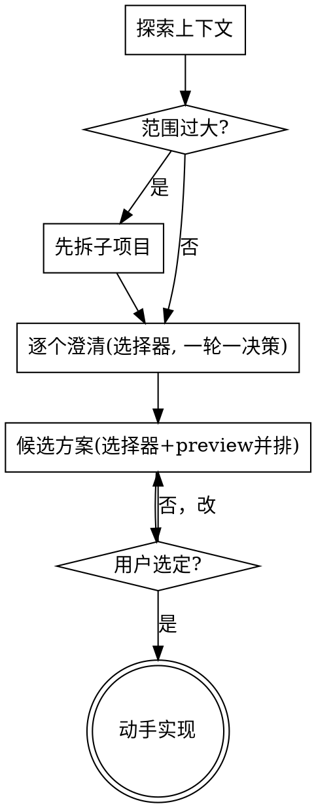

# Align：动手前对齐

把模糊想法变成对齐的方案，再动手。核心：**没对齐就别写代码。**

"太简单不用对齐"是最常踩的坑——简单需求里藏的未明假设最费返工。简单项目对齐可以只有两三句话，但**仍要呈现方案并拿到批准**。

## 硬门

```
1. 没经过「逐项确认 + 用户选定方案」之前，不写代码、不建脚手架、不调实现类 skill。
2. 禁止在一条消息里铺开多个方案，或连问多个澄清——那就是退化成「倾倒」。
```

不管项目看起来多简单，都过这道门。

## 怎么逼出交互（重点）

两层：**行为规则是地基（所有 agent 通用），结构化选择器是 Claude Code 上的增强；有选择器就用选择器，没有就严格执行行为规则。**

1. **行为规则（地基，跨 agent）** — 一条消息只放一个决策点，抛完就停、等用户回。没有结构化提问工具的 agent 全靠它。
2. **`AskUserQuestion` 选择器（Claude Code 增强）** — 在 Claude Code 上，澄清和选方案走这个原生工具：它真正结束这一轮、弹出选择器、逼用户逐项点选，从机制上堵死"想一次说清"的倾倒本能。`AskUserQuestion` 是 Anthropic 专有工具；换到无此工具的 agent → 不提工具名，直接按第 1 条执行。

`AskUserQuestion` 用法约束（Claude Code）：

- **一轮一决策** — 一次 `AskUserQuestion` 只围绕一个决策（或几个互相独立的小问），每轮最多 4 问、每问 2–4 项。
- **推荐项置顶** — 把你的推荐放第一个，label 末尾标 `(推荐)`，description 写清取舍。用户永远能选"其他"自己填。
- **方案并排预览** — 2–3 个候选别写成长文倾倒，把每个方案塞进选项的 `preview` 字段并排展示（代码片段 / ASCII mockup / 取舍）。preview 仅单选可用。
- **塞不下就退回文字** — 开放式探索、或选项 >4 项 / 文字太长塞不进选择器时，退回一问一答；但仍是**一条消息一个决策点，抛完就停**。

选方案那一轮的骨架：

```
AskUserQuestion({ questions: [{
  header: "方案",
  question: "哪种写法？",
  options: [
    { label: "队列解耦 (推荐)", description: "削峰、可重试；多一个组件",
      preview: "producer → queue → worker → db" },
    { label: "同步直连",       description: "最简单；高峰会阻塞",
      preview: "request → service → db" },
  ],
}]})
```

## 流程



## 步骤

1. **探索上下文** — 先看现有文件、文档、ADR、模块文档、入口规则、真实调用方、最近 commit；没有规范就从代码事实还原隐性契约，别在真空里问。
2. **范围检查** — 如果需求是几个独立子系统（"做个带聊天、存储、计费、分析的平台"），先喊停拆解，别急着抠某个子系统的细节。每个子项目各走一轮对齐。
3. **逐个澄清** — 走 `AskUserQuestion`，一轮一个决策、尽量给选项（多选题比开放题好答）。聚焦：目的、约束、成功标准。抛完即停，等用户点选再问下一个。
4. **抛候选方案** — 走 `AskUserQuestion`，把 2–3 个候选放进选项、推荐项置顶、用 `preview` 并排展示取舍。**不要把方案写成正文一次倒完。** 每个候选都标注：符合哪些既有 ADR / 模块文档 / 入口规则；哪些约束未知；是否跨过语义边界或扩大影响面。
5. **选定后再展开** — 用户选中某方案后，复杂细节（结构、数据流、错误处理、测试方式）再分段逐项确认，每段问"这样对吗"。
6. **选定即动手** — 直接实现。

## 关键原则

- **决策走选择器** — 这是防倾倒的机制保证，不是风格偏好。
- **一轮一决策** — 别一口气抛一堆问题或方案。
- **YAGNI** — 从每个方案里砍掉不必要的功能。
- **有替代项** — 定方案前先摆 2–3 个候选，别只给一条路。
- **增量确认** — 每个决策点获认可再往下。
- **改既有代码** — 先摸清现有结构、ADR、模块文档、入口规则和真实调用方；跟随现有风格。涉及对外行为或跨模块调用时，先判断业务语义和影响面，别把语义绑定行为误归入无差别复用路径。顺手修正阻碍当前工作的问题，但别夹带无关重构。

## 不做什么

- 不在一条消息里倾倒多个方案、或连问多个澄清。
- 不画浏览器可视化 mockup（要看图直接终端 ASCII，或塞进选项的 `preview`）。
- 不写独立 design 文档、不另起重型规划编排（独立规划文档 + 子代理那种）——对齐结论直接落到代码 / 项目自己的文档体系（ADR / 模块文档等）。
- 不在选定方案前就开建。
