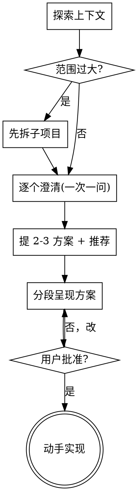

# Align：动手前对齐

把模糊想法变成对齐的方案，再动手。核心：**没对齐就别写代码。**

"太简单不用对齐"是最常踩的坑——简单需求里藏的未明假设最费返工。简单项目对齐可以只有两三句话，但**仍要呈现方案并拿到批准**。

## 硬门

```
呈现方案 + 用户批准之前，不写代码、不建脚手架、不调实现类 skill。
```

不管项目看起来多简单，都过这道门。

## 流程



## 步骤

1. **探索上下文** — 先看现有文件、文档、最近 commit，别在真空里问。
2. **范围检查** — 如果需求是几个独立子系统（"做个带聊天、存储、计费、分析的平台"），先喊停拆解，别急着抠某个子系统的细节。每个子项目各走一轮对齐。
3. **逐个澄清** — 一次只问一个问题，优先给选项（多选题比开放题好答）。聚焦：目的、约束、成功标准。
4. **提 2-3 方案** — 带取舍，开头给你的推荐和理由。
5. **分段呈现方案** — 每段按复杂度给（简单一两句，复杂的展开），每段问"这样对吗"。覆盖：结构、组件、数据流、错误处理、测试方式。
6. **批准后动手** — 直接实现。

## 关键原则

- **一次一问** — 别一口气抛一堆。
- **YAGNI** — 从每个方案里砍掉不必要的功能。
- **2-3 方案** — 定方案前先摆替代项，别只给一条路。
- **增量确认** — 每段获认可再往下。
- **改既有代码** — 先摸清现有结构、跟随现有风格；顺手修正阻碍当前工作的问题，但别夹带无关重构。

## 不做什么

- 不画浏览器可视化 mockup（要看图直接终端 ASCII 或截图）。
- 不写独立 design 文档、不转重型 plan 流程——对齐结论直接落到代码 / 项目自己的文档体系（ADR / 模块文档等）。
- 不在批准前就开建。
